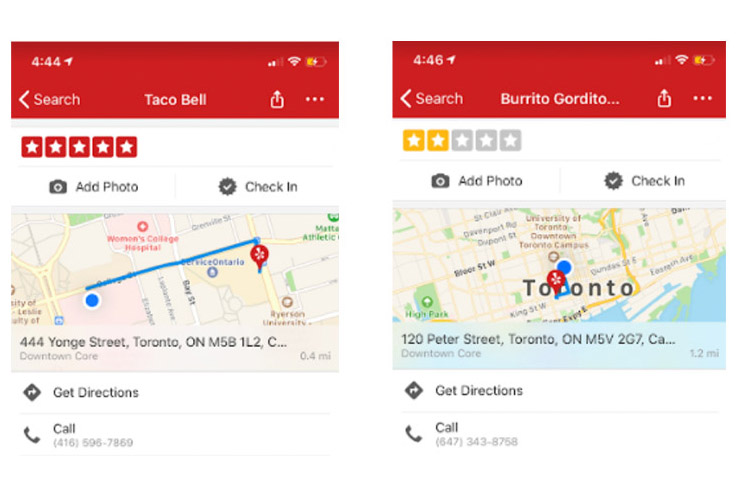
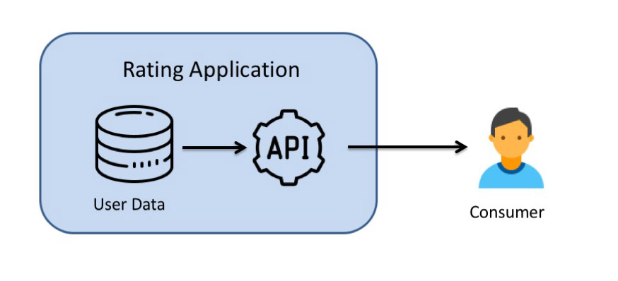

# Connecting Communities by Blockchain-powered Open Database


## 1. Brief

By utilizing blockchain tech, it's possible to build open databases with the community's collaboration independent from internet tycoons. Powered by such databases, developers from different cultural groups can reduce their cost in bootstrapping their web applications to better serve specific audiences. Local business and minorities would get more exposure and be connected with consumers.

In the submission, we have:

1. [A decentrialized Escrow and Review smart contract(SC)](https://github.com/norchain/ElevateHackathon/tree/master/SmartContract) built upon [NEO](http://neo.org/) blockchain infrastructure. 
2. [An ordering iOS App](https://github.com/norchain/ElevateHackathon/tree/master/ios) built upon mentioned SC, utilizing **TD's payment API** for payment, while joins the blockchain data and **user profile proivded by TD's API** to do the recommandation. 
3. [An recommandation web app](https://github.com/norchain/ElevateHackathon/tree/master/webapp) built upon mentioned SC, using the blockchain data to do the recommandation. 
4. [A simulation backend app](https://github.com/norchain/ElevateHackathon/tree/master/apimock) to mock blockchain,  for demostration purpose. 
5. [An interesting donation iOS app](https://github.com/norchain/ElevateHackathon/tree/master/iPadDonation/Donation) for **Tap2Pay experience**. 

The powerpoint is [HERE](http://35.230.188.187/intro).

We also have an [Video](http://35.230.188.187/video) to demostrate the iOS app in bullet 2, along with the **Tap2Pay experience**.


## 2. The Challenge

**Status**

Alice wants some authentic Maxican food and gets below search result from a popular recommendation app.



Assume the result is simply based on the majority's gentrified favours, without any centralized controversial optimization algorithm, the big Q is:

```
In the data-driven era, how would local minority services, businesses and culture better dis with their lovers?
```


## 3. The Experiment

Traditional way is like this one:



Decentralized way is like this one. Community developers can use  


